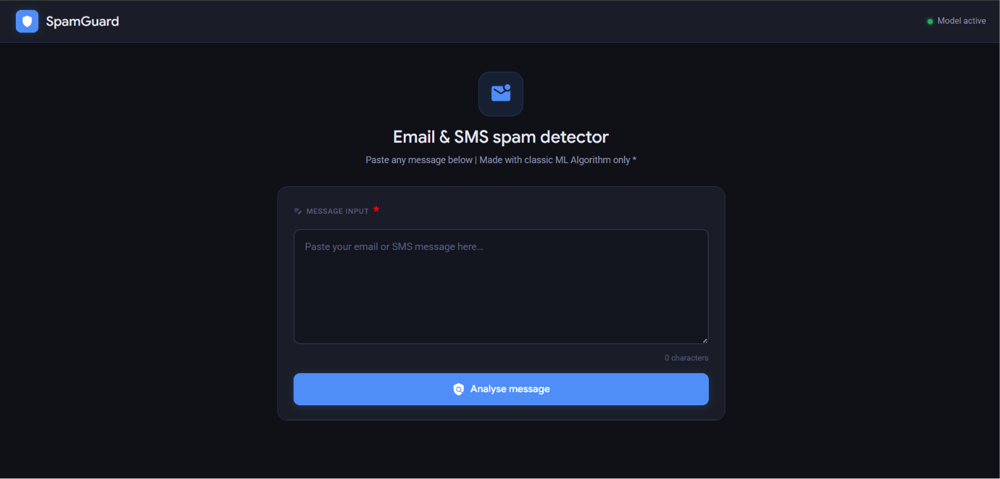
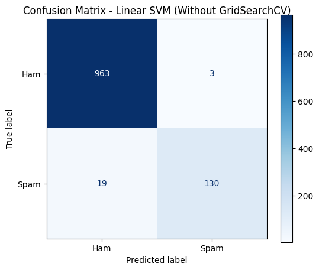

# 📧 SpamGuard — Email & SMS Spam Detector

> A machine learning web application that classifies emails and SMS messages as **Spam** or **Ham** in real time — built with Flask, Scikit-learn, and a Linear SVM model.

---

## 🚀 Live Demo
> https://spam-message-detector-model-1.onrender.com

---



---

## 📌 Project Overview

SpamGuard is an end-to-end spam detection system that takes raw email or SMS text, preprocesses it using NLP techniques, and classifies it using a trained **Linear Support Vector Machine (SVM)** model. The web interface is built with Flask and delivers results instantly via AJAX — no page reload required.

---

## 🧠 Model Performance

| Metric | Score |
|--------|-------|
| **Accuracy** | 98.03% |
| **Precision** | 97.74% |
| **Recall** | 87.25% |
| **F1 Score** | 92.20% |

### Confusion Matrix



```
                Predicted Ham    Predicted Spam
Actual Ham           963               3
Actual Spam           19             130
```

| | Value | Meaning |
|--|-------|---------|
| True Negatives (Ham → Ham) | 963 | Legitimate messages correctly identified |
| False Positives (Ham → Spam) | 3 | Legitimate messages incorrectly flagged |
| False Negatives (Spam → Ham) | 19 | Spam messages that slipped through |
| True Positives (Spam → Spam) | 130 | Spam correctly caught |

The model achieves a **false positive rate of just 0.31%**, meaning almost no legitimate messages are wrongly flagged — a critical metric for real-world usability.

---

## 🛠️ Tech Stack

| Layer | Technology |
|-------|-----------|
| Backend | Python 3, Flask |
| ML Model | Scikit-learn — Linear SVM (`LinearSVC`) |
| NLP | NLTK — stopword removal, Porter stemming |
| Frontend | HTML5, Bootstrap 5, Material Icons |
| Model Persistence | Joblib |

---

## 📁 Project Structure

```
spamguard/
│
├── app.py                  # Flask application & route logic
├── train.py                # Model training script
├── spam_classifier.pkl     # Serialised trained model
│
├── templates/
│   └── index.html          # Dark-mode web UI (Jinja2 + AJAX)
│
├── docs/
│   ├── confusion_matrix.png
│   └── preview.png
│
├── requirements.txt
└── README.md
```

---

## ⚙️ Setup & Installation

### 1. Clone the repository

```bash
git clone https://github.com/your-username/spamguard.git
cd spamguard
```

### 2. Create a virtual environment

```bash
python -m venv venv
source venv/bin/activate        # Linux / macOS
venv\Scripts\activate           # Windows
```

### 3. Install dependencies

```bash
pip install -r requirements.txt
```

### 4. Download NLTK data

```python
import nltk
nltk.download('stopwords')
```

### 5. Run the app

```bash
python app.py
```

Open your browser at `http://127.0.0.1:5000`

---

## 🔬 How It Works

```
Raw Message
    │
    ▼
Lowercase + remove special chars
    │
    ▼
Tokenise → remove stopwords → Porter stemming
    │
    ▼
TF-IDF Vectorisation
    │
    ▼
Linear SVM predict()
    │
    ▼
"Spam" or "Ham"
```

1. **Preprocessing** — text is lowercased, non-alphabetic characters are stripped, stopwords removed, and words reduced to their stem using `PorterStemmer`.
2. **Vectorisation** — the cleaned text is transformed into a TF-IDF feature vector (fitted during training).
3. **Classification** — the Linear SVM model predicts whether the vector belongs to the spam or ham class.
4. **Response** — Flask returns a JSON response `{ "prediction": "Spam" }` which the frontend renders without a page reload.

---

## 📡 API

### `POST /`

Accepts JSON and returns a prediction.

**Request**
```json
{
  "message": "Congratulations! You have won a $1000 gift card. Click here now!"
}
```

**Response**
```json
{
  "prediction": "Spam"
}
```

---

## 📦 requirements.txt

```
flask
scikit-learn
nltk
joblib
```

---

## 🧪 Sample Test Messages

**Spam examples**
- `"Congratulations! You've won a $1000 Walmart gift card. Click here to claim now!"`
- `"URGENT: Your account has been suspended. Verify your details immediately."`
- `"You have been selected for a FREE iPhone 15! Call 1-800-FREE-WIN to claim."`

**Ham examples**
- `"Hey, are we still meeting at 6pm tonight? Let me know if you need to reschedule."`
- `"Hi, please find attached the project report for Q3. Let me know if you have questions."`
- `"Your dentist appointment is tomorrow at 10:30 AM at City Dental Clinic."`

---

## 📊 Model Training

To retrain the model on your own dataset:

```bash
python train.py
```

The training script expects a CSV with columns `label` (0 = ham, 1 = spam) and `message`.

---

## 🙋 Author

**Phani Kumar Kodukulla**

---

## 📄 License

This project is licensed under the MIT License. See [LICENSE](LICENSE) for details.
